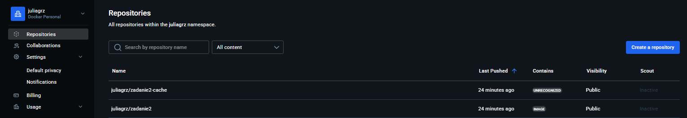

# Zadanie 2 – CI/CD z GitHub Actions i Docker

## Opis

- Buduje obraz aplikacji (rozwiązanie zadania nr 1) na podstawie Dockerfile
- Wspiera wieloarchitekturowość: `linux/amd64` i `linux/arm64`
- Wysyła zbudowany obraz do publicznego repozytorium GitHub
- Wykorzystuje cache przy buildzie — przechowywany w dedykowanym repozytorium na DockerHub
- Wykonuje skanowanie CVE (Trivy), które zatrzymuje proces, jeśli obraz zawiera podatności o poziomie HIGH lub CRITICAL

## Zagrozenie HIGH
(tag v1.1.4) skaner Trivy wykrył zagrożenie typu HIGH - w związku z tym proces publikacji obrazu został zatrzymany, zgodnie z konfiguracją (exit-code: '1' przy wykryciu HIGH/CRITICAL)  
Poprawka i ponowne uruchomienie - Zaktualizowano Dockerfile, dodając npm audit fix oraz instalację najnowszej wersji npm w alpine 
## Poprawienie Dockerfile - brak błędów HIGH/CRITICAL 
Przeprowadzono ponowną analizę CVE w pipeline (tag v1.1.5)  
Skan Trivy nie wykazał żadnych krytycznych ani wysokich zagrożeń — co umożliwiło wypchnięcie obrazu do GitHub  

juliagrz/zadanie2 - Główne repozytorium z obrazem aplikacji  
juliagrz/zadanie2-cache - Repozytorium wykorzystywane do cache'u budowania  

## Tagowanie obrazów
Zastosowano następujące formaty tagów (określane przez docker/metadata-action):  
sha-<skrót_commit> — identyfikuje unikalnie obraz powiązany z konkretnym commitem  
v<semver> (np. v1.1.5) — wersjonowanie semantyczne publikacji  
main (dla brancha głównego) — obraz z ostatniego buildu z main  
